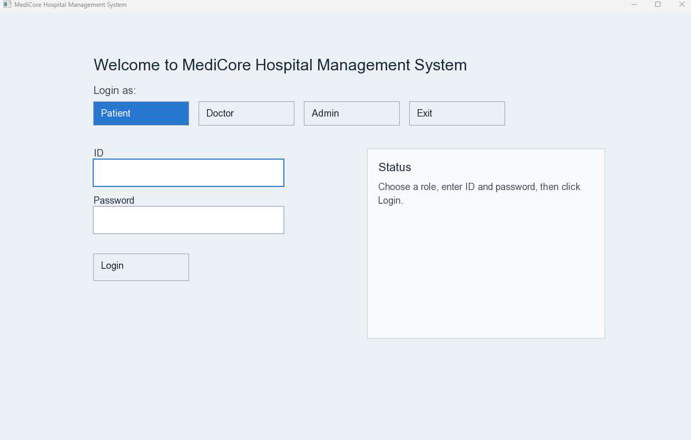

# MediCore Hospital Management System

MediCore is a C++ Object Oriented Programming project for a fictional hospital management system. It supports three roles: `Patient`, `Doctor`, and `Admin`. The program uses a simple SFML-based GUI and stores all data in `.txt` files so that records remain available after the program is closed and opened again.

## Tech Stack / Tags

<a href="#" alt="Language">
  </a>
<a href="#" alt="Paradigm">
  </a>
<a href="#" alt="GUI">
  </a>
<a href="#" alt="Build">
  </a>
<a href="#" alt="Compiler">
  </a>
<a href="#" alt="Storage">
  </a>
<a href="#" alt="Concepts">
  </a>

## Project Screenshot

After adding your screenshot file into the project, place it in the `assets` folder and keep this line in the README:

```md

```

Example:


This project was built to follow a typical OOP semester project style:
- separate `.h` and `.cpp` files
- inheritance through a common abstract base class
- operator overloading where required
- template class usage
- custom exceptions
- manual validation and sorting logic
- file-based persistence

## Project Overview

The system manages:
- user login for `Patient`, `Doctor`, and `Admin`
- hospital appointments
- prescriptions and medical records
- billing and patient balance
- security logging after repeated failed logins
- daily reports for admin
- patient discharge and archive

All major actions update the data files immediately. On startup, the program reads the saved files again and restores the current state.

## Main Features

### Patient Features
- login with ID and password
- view own appointments
- view own medical records
- view own bills
- top up account balance
- search doctors by specialization
- book appointment
- cancel pending appointment
- pay unpaid bills

### Doctor Features
- login with ID and password
- view today's appointments
- mark appointment as completed
- mark appointment as no-show
- write prescription for completed appointment
- view medical history of own patients

### Admin Features
- login with ID and password
- add doctor
- remove doctor
- view all patients
- view all doctors
- view all appointments
- view unpaid bills
- view security log
- generate daily report
- discharge patient and archive records

## OOP Concepts Used

### Inheritance
- `Person` is the abstract base class
- `Patient`, `Doctor`, and `Admin` inherit from `Person`

### Abstraction
- `Person` has pure virtual functions, so it cannot be created directly
- shared identity information is handled through the base class

### Encapsulation
- class data is stored as private/protected members
- class behavior is exposed through public methods

### Polymorphism
- `Person` uses virtual functions so derived classes can provide their own behavior

### Operator Overloading
The project includes the required operator overloads:
- `Patient +=` to add balance
- `Patient -=` to deduct balance
- `Patient ==` to compare patient IDs
- `Doctor ==` to compare doctor IDs
- `Appointment ==` to detect slot conflict
- `<<` for `Patient`
- `<<` for `Doctor`
- `<<` for `Appointment`

### Templates
- `Storage<T>` is a generic template class used to hold records for multiple entity types

### Exception Handling
Custom exceptions used:
- `HospitalException`
- `FileNotFoundException`
- `InsufficientFundsException`
- `InvalidInputException`
- `SlotUnavailableException`

## Project Structure

### Header Files
- [Admin.h](C:/Users/m-uxa/Desktop/25L-2582/include/Admin.h)
- [Appointment.h](C:/Users/m-uxa/Desktop/25L-2582/include/Appointment.h)
- [Bill.h](C:/Users/m-uxa/Desktop/25L-2582/include/Bill.h)
- [Doctor.h](C:/Users/m-uxa/Desktop/25L-2582/include/Doctor.h)
- [FileHandler.h](C:/Users/m-uxa/Desktop/25L-2582/include/FileHandler.h)
- [FileNotFoundException.h](C:/Users/m-uxa/Desktop/25L-2582/include/FileNotFoundException.h)
- [Gui.h](C:/Users/m-uxa/Desktop/25L-2582/include/Gui.h)
- [HospitalException.h](C:/Users/m-uxa/Desktop/25L-2582/include/HospitalException.h)
- [HospitalSystem.h](C:/Users/m-uxa/Desktop/25L-2582/include/HospitalSystem.h)
- [InsufficientFundsException.h](C:/Users/m-uxa/Desktop/25L-2582/include/InsufficientFundsException.h)
- [InvalidInputException.h](C:/Users/m-uxa/Desktop/25L-2582/include/InvalidInputException.h)
- [Patient.h](C:/Users/m-uxa/Desktop/25L-2582/include/Patient.h)
- [Person.h](C:/Users/m-uxa/Desktop/25L-2582/include/Person.h)
- [Prescription.h](C:/Users/m-uxa/Desktop/25L-2582/include/Prescription.h)
- [SlotUnavailableException.h](C:/Users/m-uxa/Desktop/25L-2582/include/SlotUnavailableException.h)
- [Storage.h](C:/Users/m-uxa/Desktop/25L-2582/include/Storage.h)
- [TextUtil.h](C:/Users/m-uxa/Desktop/25L-2582/include/TextUtil.h)
- [Validator.h](C:/Users/m-uxa/Desktop/25L-2582/include/Validator.h)

### Source Files
- [main.cpp](C:/Users/m-uxa/Desktop/25L-2582/src/main.cpp)
- [HospitalSystem.cpp](C:/Users/m-uxa/Desktop/25L-2582/src/HospitalSystem.cpp)
- [Gui.cpp](C:/Users/m-uxa/Desktop/25L-2582/src/Gui.cpp)
- [FileHandler.cpp](C:/Users/m-uxa/Desktop/25L-2582/src/FileHandler.cpp)
- [Validator.cpp](C:/Users/m-uxa/Desktop/25L-2582/src/Validator.cpp)
- [Storage.cpp](C:/Users/m-uxa/Desktop/25L-2582/src/Storage.cpp)
- entity and exception implementation files in [src](C:/Users/m-uxa/Desktop/25L-2582/src)

### Data Files
- [patients.txt](C:/Users/m-uxa/Desktop/25L-2582/data/patients.txt)
- [doctors.txt](C:/Users/m-uxa/Desktop/25L-2582/data/doctors.txt)
- [admin.txt](C:/Users/m-uxa/Desktop/25L-2582/data/admin.txt)
- [appointments.txt](C:/Users/m-uxa/Desktop/25L-2582/data/appointments.txt)
- [prescriptions.txt](C:/Users/m-uxa/Desktop/25L-2582/data/prescriptions.txt)
- [bills.txt](C:/Users/m-uxa/Desktop/25L-2582/data/bills.txt)
- [security_log.txt](C:/Users/m-uxa/Desktop/25L-2582/data/security_log.txt)
- [discharged.txt](C:/Users/m-uxa/Desktop/25L-2582/data/discharged.txt)

## Important Classes

### `Person`
- abstract base class
- stores common information like ID, name, contact, and password

### `Patient`
- stores age, gender, and balance
- supports top up, bill payment, booking, and cancellation logic

### `Doctor`
- stores specialization and consultation fee
- supports appointment handling and prescription writing

### `Admin`
- represents the administrator account loaded from file

### `Appointment`
- stores appointment ID, patient ID, doctor ID, date, slot, and status
- checks schedule conflicts using overloaded `==`

### `Bill`
- stores billing details related to an appointment

### `Prescription`
- stores medicines and notes written by a doctor

### `Storage<T>`
- fixed-size template storage class
- provides add, remove, find, get all, and size

### `FileHandler`
- only class responsible for file reading and writing
- loads, saves, appends, updates, and deletes records

### `Validator`
- only class responsible for validation
- validates IDs, dates, contacts, password, floats, slots, and menu-related values

### `HospitalSystem`
- contains the main project logic
- connects entities, validation, storage, billing, login, and file persistence

### `Gui`
- creates the SFML user interface
- handles login screen, role menus, forms, text display, and button clicks

## Default Sample Data

The project currently starts with the following sample data:

### Patient Accounts
- Patient `1`: `Hamza Nadeem`
  - Password: `pass123`
  - Balance: `7000.00`
- Patient `2`: `Iqra Fatima`
  - Password: `patient2`
  - Balance: `5200.00`

### Doctor Accounts
- Doctor `1`: `Dr. Mahnoor Siddiqui`
  - Specialization: `Cardiology`
  - Password: `doc456`
  - Fee: `1700.00`
- Doctor `2`: `Dr. Bilal Qureshi`
  - Specialization: `Neurology`
  - Password: `doc789`
  - Fee: `1400.00`

### Admin Account
- Admin `1`
  - Name: `Admin`
  - Password: `admin123`

### Default Records
- one completed appointment
- one pending appointment
- one saved prescription
- one paid bill
- one unpaid bill

## File Format Summary

All data is stored using comma-separated values.

### `patients.txt`
`patient_id,name,age,gender,contact,password,balance`

### `doctors.txt`
`doctor_id,name,specialization,contact,password,fee`

### `admin.txt`
`admin_id,name,password`

### `appointments.txt`
`appointment_id,patient_id,doctor_id,date,time_slot,status`

### `prescriptions.txt`
`prescription_id,appointment_id,patient_id,doctor_id,date,medicines,notes`

### `bills.txt`
`bill_id,patient_id,appointment_id,amount,status,date`

### `security_log.txt`
`timestamp,role,entered_id,result`

### `discharged.txt`
- used as an archive file when a patient is discharged

## Build Requirements

This project was built and tested with:
- C++
- CMake
- MinGW `g++`
- SFML

The current [CMakeLists.txt](C:/Users/m-uxa/Desktop/25L-2582/CMakeLists.txt) expects a local SFML installation and uses:
- C++ standard `11`
- `sfml-graphics`
- `sfml-window`
- `sfml-system`

## How To Build

1. Open a terminal in the project folder:

```powershell
cd C:\Users\m-uxa\Desktop\25L-2582
```

2. Configure the project:

```powershell
cmake -S . -B build
```

3. Build the project:

```powershell
cmake --build build
```

4. Run the executable:

```powershell
.\build\MediCore.exe
```

## Important Build Note

The project currently uses the local SFML path already configured inside [CMakeLists.txt](C:/Users/m-uxa/Desktop/25L-2582/CMakeLists.txt):

`C:/Users/m-uxa/Desktop/oop_project/SFML-2.6.1/build`

If SFML is stored somewhere else on another computer, update `SFML_DIR` inside `CMakeLists.txt` before building.

## How To Run In VS Code

1. Open the folder `C:\Users\m-uxa\Desktop\25L-2582` in VS Code.
2. Open the terminal inside VS Code.
3. Run:

```powershell
cmake -S . -B build
cmake --build build
.\build\MediCore.exe
```

## How Persistence Works

The project does not rely on hardcoded runtime state after launch. Instead:
- files are loaded on startup
- actions modify in-memory data
- files are updated immediately
- reopening the app restores the latest saved data

Examples:
- booking an appointment updates `appointments.txt`, `bills.txt`, and `patients.txt`
- paying a bill updates `bills.txt` and `patients.txt`
- writing a prescription updates `prescriptions.txt`
- failed logins update `security_log.txt`

## Validation Rules Implemented

The project includes validation for:
- valid positive IDs
- date format `DD-MM-YYYY`
- valid time slots
- 11-digit contact numbers
- minimum password length
- positive floating-point values

## Sorting Rules Implemented

The system uses manual sorting logic instead of library sort functions:
- patient appointments sorted by date ascending
- patient medical records sorted by date descending
- doctor today's appointments sorted by time ascending
- admin all appointments sorted by date descending

## Error Handling

The project uses custom exceptions for common invalid situations:
- file missing on startup
- invalid input
- insufficient funds
- unavailable time slot

These exceptions help keep the logic separated and easier to trace during evaluation.

## Manual Testing Suggestions

### Patient Flow
- login as patient
- top up balance
- search doctor by specialization
- book appointment
- cancel appointment
- pay unpaid bill

### Doctor Flow
- login as doctor
- view today's appointments
- mark appointment complete
- mark appointment no-show
- write prescription
- view patient history

### Admin Flow
- login as admin
- add doctor
- remove doctor
- view all patients
- view all appointments
- view unpaid bills
- generate daily report

### Persistence Check
- perform a change
- close the program
- run it again
- verify the data still exists

## Evaluation Demo Order

If you are presenting this project, the safest demo order is:

1. Show login screen
2. Login as patient and book appointment
3. Show updated files
4. Login as doctor and complete appointment
5. Write prescription
6. Login as admin and show appointments or report
7. Close and reopen program
8. Show persistence from files

## Limitations / Notes

- this project intentionally avoids `std::vector`
- this project intentionally avoids `std::string` in the main project code
- storage is fixed-size through `Storage<T>`
- the GUI is simple and student-level, not a commercial interface
- the code is kept closer to beginner OOP style rather than advanced production style

## Submission Notes

- keep all `.h` and `.cpp` files in the final submission
- include this `README.md`
- include your public GitHub repository link below
- submit the zip file using the required roll number naming format

GitHub Repository Link: `ADD-YOUR-REPOSITORY-LINK-HERE`
